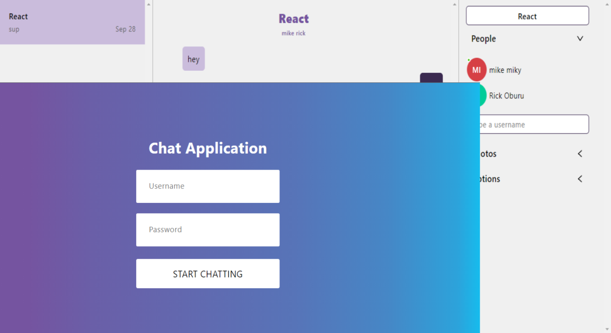

# Chat Application


## About

This is a chat App where a user can send messages to friends and family created using React and Chatengine.io using there
Chat UI Kit and Rest APIs


## Use: Demo accounts with password
### username: `rick` Password: `123`
### username: `mike` Password: `123`

Open two new windows of your prefered browser and login with creditials provided above to test


To build this application I used:

- Javascript ES6;
- Html/CSS;
- React;
- Chat UI Kit and Rest APIs

## Live-Demo

[The live demo link](https://chat-app-kappa-neon.vercel.app/)

## Screenshots




## Features

- Messaging capabilities
- Authentication
- Ability to see if a user is online


## Getting started (Feature)

To get a local copy of the repository please run the following commands on your terminal:

```
$ git clone https://github.com/RICKCOYL/Chat-App.git
$ cd Chat-App
$ npm install
$ npm run start 

```

## Launch the application

After making the local copy of the repository:
- get inside the repository folder;
- setup the dependencies of the project: in the terminal run: ```npm install```
- enter the command: ```npm start``` to start the server in localhost.
- then you get the application in the localhost in your web browser.

## Author

👤 **RICK OBURU**

- Github: [@RICKCOYL](https://github.com/RICKCOYL)
- Twitter: [@rickcoyl](https://twitter.com/rickcoyl)
- Linkedin: [Rick Oburu](https://www.linkedin.com/in/rickoburu/)

## 🤝 Contributing

Contributions, issues ,and feature requests are welcome!

## Show your support

Give an ⭐️ if you like this project!

## Issues
If you would like to report an issue [the link](https://github.com/RICKCOYL/Chat-App/issues)

## 📝 License

All source code is available jointly under the MIT License.
See [MIT licence](./LICENSE.md) for details.
